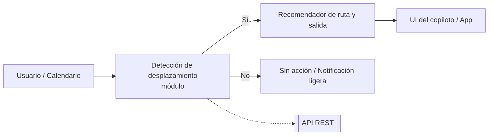

# 🚀 NextEdge Deusto · Calendar Copilot — Módulo de Detección de Desplazamiento

Clasificación de eventos de calendario para anticipar **si requieren desplazamiento** y habilitar recomendaciones de **ruta y hora de salida**. Sin instrucciones técnicas exhaustivas; foco en visión, valor y resultados.

---

## 🎯 Propósito
Detectar, a partir del **título** de un evento, si el usuario **necesitará moverse**. Esta capacidad nutre al copiloto de movilidad para **avisar a tiempo**, **preparar rutas** y **optimizar el día**.

**Aporta valor porque…**
- Anticipa desplazamientos antes de que empiecen.
- Reduce retrasos y mejora la puntualidad.
- Conecta agenda, tráfico y preferencias de movilidad.

---

## 🧩 Encaje en el copiloto

- Entrada: **título** del evento de calendario.
- Salida: `label` (requiere/no) y `score` (confianza).

---

## 📚 Datos y método
- 250 eventos **reales** anotados.
- +1.000 ejemplos **sintéticos** para diversidad semántica.  
- Modelos evaluados: **Árbol**, **Random Forest**, **MLP sobre TF‑IDF**, **DistilBERT**.

---

## 📈 Resultados (resumen)
**Dataset original (250 reales):**
| Modelo | Precisión | F1 |
|---|---:|---:|
| Árbol de decisión | 0.90 | 0.90 |
| Random Forest | 0.90 | 0.90 |
| MLP (TF‑IDF) | **0.94** | **0.94** |
| DistilBERT | 0.86 | 0.83 |

**Dataset ampliado (250 + 1.000 sintéticos):**
| Modelo | Precisión | F1 |
|---|---:|---:|
| **Random Forest** | **0.96** | **0.96** |
| DistilBERT | 0.94 | 0.94 |
| MLP (TF‑IDF) | 0.93 | 0.93 |

> Con más datos, **RF** pasa a líder. Con pocos, **MLP+TF‑IDF** es competitivo y ligero.

---

## 🛠️ Materializado como servicio
- **API REST** empaquetada con **BentoML**.
- **UI ligera** para prueba rápida (**/app**).
- Contenedorización para despliegue flexible.

**Contrato del endpoint** (esquema):
```json
{ "title": "Cita médica - Clínica Santa María" }
→ { "label": 1, "score": 0.96 }
```

---

## 🗂️ Repos dentro de la organización
- **calendar_labs** · Exploración, datasets y cuadernos de entrenamiento.  
- **calendar_ml** · Servicio con BentoML + UI /app.  
- **calendar_ops** · CI/CD y despliegue (Docker/K8s).

> Los artefactos de modelo (`*.bentomodel`) se alojan en **Drive** y se importan en cada entorno. No van a git.

## 🔗 Enlaces
- Labs → https://github.com/NextEdge-Deusto/calendar_labs  
- ML Service → https://github.com/NextEdge-Deusto/calendar_ml  
- Ops/Deploy → https://github.com/NextEdge-Deusto/calendar_ops
