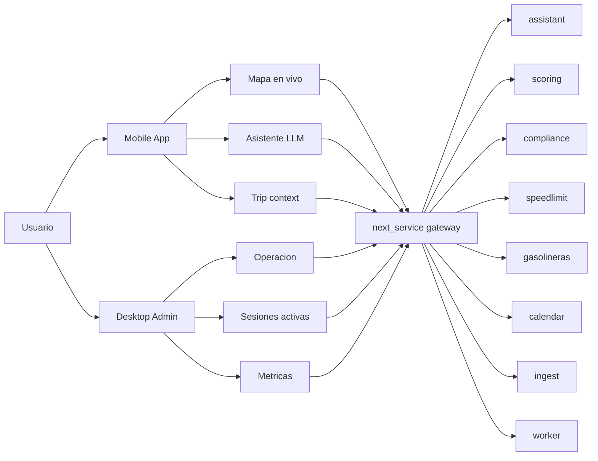

# NextEdge Deusto

  

  
  
  

NextEdge Deusto está construyendo un copiloto operativo donde **`next_frontend`** y **`next_service`** funcionan como una sola plataforma:

- una experiencia **desktop** para operación y supervisión,
- una experiencia **mobile** con mapa, viaje en vivo y asistencia,
- un **gateway backend** que conecta microservicios de dominio,
- y un asistente LLM que guía al usuario y activa capacidades del sistema.

## Núcleo Del Producto

### [`next_frontend`](https://github.com/NextEdge-Deusto/next_frontend)
- Panel desktop para operación, sesiones y monitorización.
- App móvil para conducción, mapa, contexto de viaje y flujo live.
- Capa compartida de tipos, auth, API y WebSocket.

### [`next_service`](https://github.com/NextEdge-Deusto/next_service)
- Gateway principal expuesto en `:8000`.
- Orquesta servicios de:
  `assistant`, `auth`, `calendar`, `compliance`, `gasolineras`, `ingest`, `scoring`, `speedlimit`, `worker`.

## Cómo Encaja

```mermaid
flowchart LR
  U[Usuario] --> M[Mobile App]
  U --> D[Desktop Admin]

  M --> MAP[Mapa en vivo]
  M --> CHAT[Asistente LLM]
  M --> TRIP[Trip context]

  D --> OPS[Operacion]
  D --> LIVE[Sesiones activas]
  D --> METRICS[Metricas]

  MAP --> G[next_service gateway]
  CHAT --> G
  TRIP --> G
  OPS --> G
  LIVE --> G
  METRICS --> G

  G --> ASSIST[assistant]
  G --> SCORE[scoring]
  G --> COMP[compliance]
  G --> SPEED[speedlimit]
  G --> GAS[gasolineras]
  G --> CAL[calendar]
  G --> ING[ingest]
  G --> WORK[worker]
```

## Repos Clave

| Repo | Papel |
|---|---|
| [`next_frontend`](https://github.com/NextEdge-Deusto/next_frontend) | producto visible: desktop + mobile |
| [`next_service`](https://github.com/NextEdge-Deusto/next_service) | backend, gateway y servicios |
| [`next_assistant`](https://github.com/NextEdge-Deusto/next_assistant) | líneas de trabajo de asistente y UX conversacional |
| [`next_copilot`](https://github.com/NextEdge-Deusto/next_copilot) | exploración de datos y utilidades de soporte |
| [`driving-ranking`](https://github.com/NextEdge-Deusto/driving-ranking) | scoring y análisis de conducción |
| [`calendar_labs`](https://github.com/NextEdge-Deusto/calendar_labs) | experimentación con calendario y datasets |
| [`calendar_models`](https://github.com/NextEdge-Deusto/calendar_models) | modelos y servicio alrededor de calendario |

## Ahora Mismo

- `next_frontend` y `next_service` son el centro del desarrollo.
- El mapa, el asistente y los servicios de dominio forman la experiencia principal.
- El resto de repos alimentan capacidades concretas del copiloto.

  

