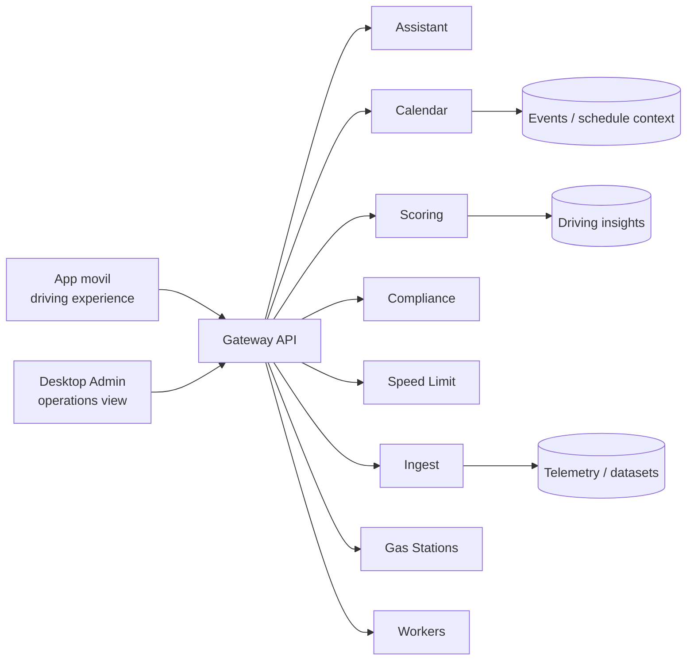

# [NextEdge Deusto](https://github.com/NextEdge-Deusto)

  

  

  
  
  
  

## Qué Construye Esta Organización

NextEdge Deusto está evolucionando desde repos aislados hacia un ecosistema de producto conectado.  
Ahora mismo el foco principal de desarrollo está en los repos **`next_frontend`** y **`next_service`**, donde se está construyendo la plataforma central con:

- un **panel desktop** para operación y monitorización,
- una **app móvil de conducción** para sesiones en vivo y flujos de asistente,
- un **backend dividido en microservicios de dominio** detrás de un gateway,
- y varios repos satélite para telemetría, ranking, asistentes, calendario y exploración de datos.

La idea ya no es una demo suelta. La dirección es una **plataforma componible** donde copilots, telemetría, eventos, compliance y datos operativos trabajan juntos.

## Plataforma Principal Actual

### `next_frontend`
- **App desktop de administración** con Vue 3, Vite, Tailwind y ECharts.
- **App móvil de conducción** con Nuxt 4, PWA, mapas y experiencia live trip.
- Paquete compartido para tipos, auth, acceso a API y contratos WebSocket.

### `next_service`
- Gateway backend expuesto en `:8000`.
- Servicios de dominio para:
  - `assistant`
  - `auth`
  - `calendar`
  - `compliance`
  - `gasolineras`
  - `ingest`
  - `scoring`
  - `speedlimit`
  - `worker`

## Forma del Sistema

```mermaid
flowchart LR
  M[App movil<br/>driving experience] --> G[Gateway API]
  D[Desktop Admin<br/>operations view] --> G
  G --> A[Assistant]
  G --> C[Calendar]
  G --> S[Scoring]
  G --> P[Compliance]
  G --> L[Speed Limit]
  G --> I[Ingest]
  G --> F[Gas Stations]
  G --> W[Workers]
  I --> T[(Telemetry / datasets)]
  C --> E[(Events / schedule context)]
  S --> R[(Driving insights)]
```

## Repos del Ecosistema

<table>
  <tr>
    <td width="50%">
      
    </td>
    <td width="50%">
      
    </td>
  </tr>
  <tr>
    <td width="50%">
      
    </td>
    <td width="50%">
      
    </td>
  </tr>
  <tr>
    <td width="50%">
      
    </td>
    <td width="50%">
      
    </td>
  </tr>
  <tr>
    <td width="50%">
      
    </td>
    <td width="50%">
      
    </td>
  </tr>
</table>

## Líneas de Trabajo

| Área | Qué está pasando ahora |
|---|---|
| Producto principal | `next_frontend` y `next_service` concentran la evolución de la plataforma |
| Copilot UX | Experiencia dual: escritorio de operación + asistente móvil en vivo |
| Movilidad | Contexto de ruta, viaje, gasolineras y soporte al conductor |
| Inteligencia de calendario | Comprensión de eventos y predicción de desplazamiento |
| Telemetría | Exploración, limpieza y extracción de señales del dataset |
| Scoring | Análisis de calidad de conducción y compliance |
| Plataforma | Backend con gateway y descomposición por servicios |

## Snapshot Técnico

  
  

## Por Qué Existe Este README

Este perfil es la puerta de entrada de la organización. Tiene que explicar la plataforma, no solo un modelo o un experimento concreto.  
Los repos de aquí representan capas distintas de una misma dirección: **copilots que combinan producto, APIs operativas, señales del mundo real y AI aplicada**.

---

  README de perfil mantenido como mapa público de la organización mientras la plataforma sigue evolucionando.

